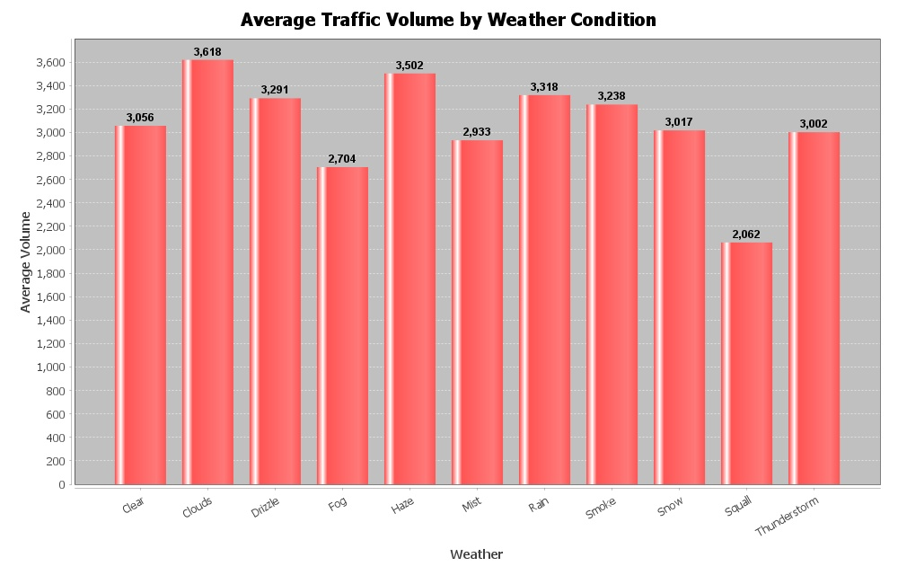

# Interstate Traffic Volume Analysis (Java)

This project presents an exploratory analysis of interstate highway traffic volume
using a structured Java-based data pipeline. The objective is to extract meaningful
temporal and contextual insights from a real-world transportation dataset and to
communicate those findings through clear, interpretable visualizations.

Rather than focusing on predictive modeling, the project emphasizes data ingestion,
aggregation, and visualization, highlighting analytical reasoning, reproducibility,
and software engineering practices relevant to applied data analysis.

---

## Dataset

- **Name:** Metro Interstate Traffic Volume
- **Original Source:** UCI Machine Learning Repository
- **Author:** Hogue, J. (2019)
- **Secondary Distribution:** Kaggle (uploaded by Ansh Tanwar)
- **Description:** Hourly traffic volume observations for a U.S. interstate highway,
  enriched with temporal features (hour, weekday/weekend) and weather attributes.

> The dataset is not included directly in this repository.  
> Download the CSV file and place it in `data/raw/` before running the analysis.

---

## Project Objectives

- Load and validate a real-world CSV dataset using Java
- Model traffic observations with strongly typed, immutable data structures
- Perform exploratory traffic volume analysis
- Identify time-of-day, weekday/weekend, and weather-related patterns
- Generate publication-quality charts suitable for academic or professional use

---

## Key Results & Insights

### 1. Hourly Traffic Volume Patterns


**Figure 1.** Analysis of average traffic volume by hour reveals a strong temporal structure.

**Findings:**
- Traffic volume follows a predictable daily cycle
- Peak demand occurs in the late afternoon, consistent with commuter return trips
- Overnight hours exhibit minimal traffic volume

These patterns reflect the influence of work schedules and daily travel routines
on interstate traffic demand.

---

### 2. Weekday vs Weekend Traffic Behavior


**Figure 2.** Line-curve comparisons highlight clear differences between weekday and weekend travel.

**Findings:**
- Weekday traffic exhibits sharper and higher peaks
- Weekend traffic is flatter and shifts toward midday
- Peak weekday traffic occurs later in the day than weekend peaks

This contrast demonstrates how structured commuting drives weekday congestion,
while discretionary travel dominates weekends.

---

### 3. Weather Context and Traffic Volume



**Figure 3.** Traffic volume was aggregated by primary weather condition.

**Findings:**
- Clear and cloudy conditions correspond to the highest average traffic volumes
- Rain and snow are associated with reduced traffic demand
- Weather effects are present but smaller in magnitude than time-of-day effects

Weather adds important context for understanding when high demand coincides with
increased driving risk.

---

## Technical Approach

- **Language:** Java 17  
- **Build System:** Maven  
- **Libraries:**
  - Apache Commons CSV — data ingestion and parsing
  - JFreeChart — visualization and chart export

### Core Components

- `TrafficRecord` — immutable data model representing a single observation  
- `TrafficDataLoader` — CSV parsing and validation logic  
- `TrafficAnalysis` — aggregation and statistical analysis methods  
- `TrafficCharts` — chart creation and image export  
- `App` — application entry point

---

## References

Hogue, J. (2019). *Metro Interstate Traffic Volume* [Dataset].  
UCI Machine Learning Repository. https://doi.org/10.24432/C5X60B

---

## Project Structure

```text
src/
└── main/
    └── java/
        └── com/traffic/analysis/
            ├── App.java
            ├── TrafficRecord.java
            ├── TrafficDataLoader.java
            ├── TrafficAnalysis.java
            └── TrafficCharts.java

data/
└── raw/
    └── .gitkeep

docs/
├── index.html
├── styles.css
└── images/

reports/
├── hourly-curves.jpg
├── traffic-volume.jpg
├── weather-impact.jpg
└── weekday_vs_weekend.jpg

pom.xml
